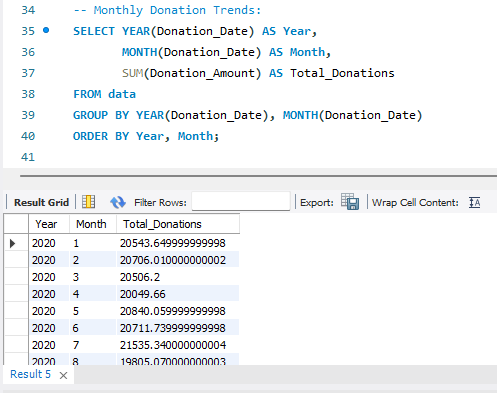
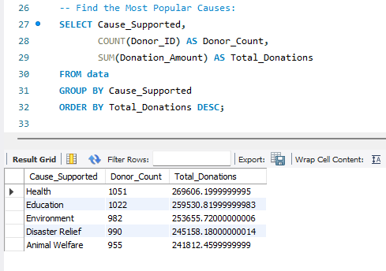
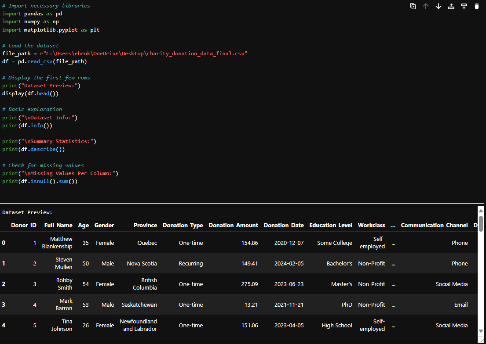
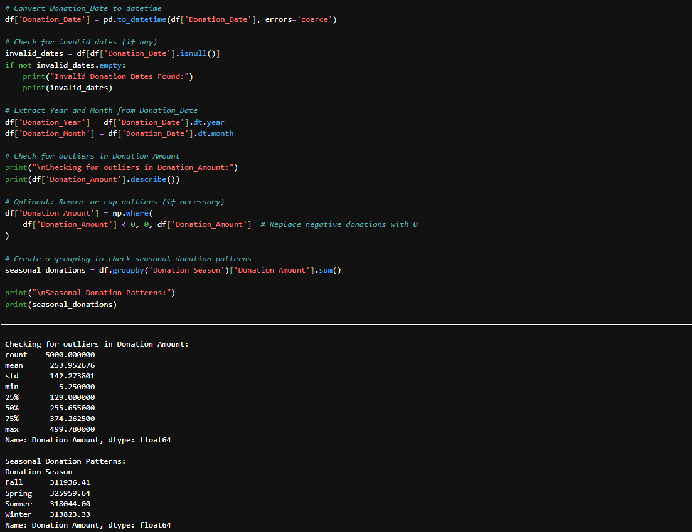
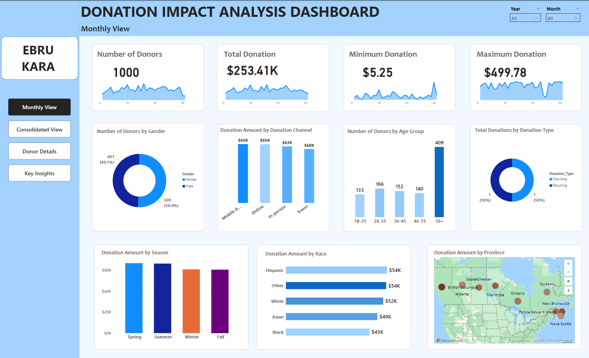
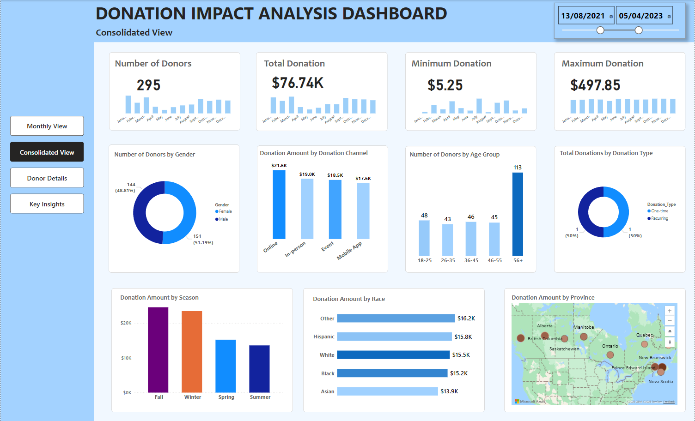
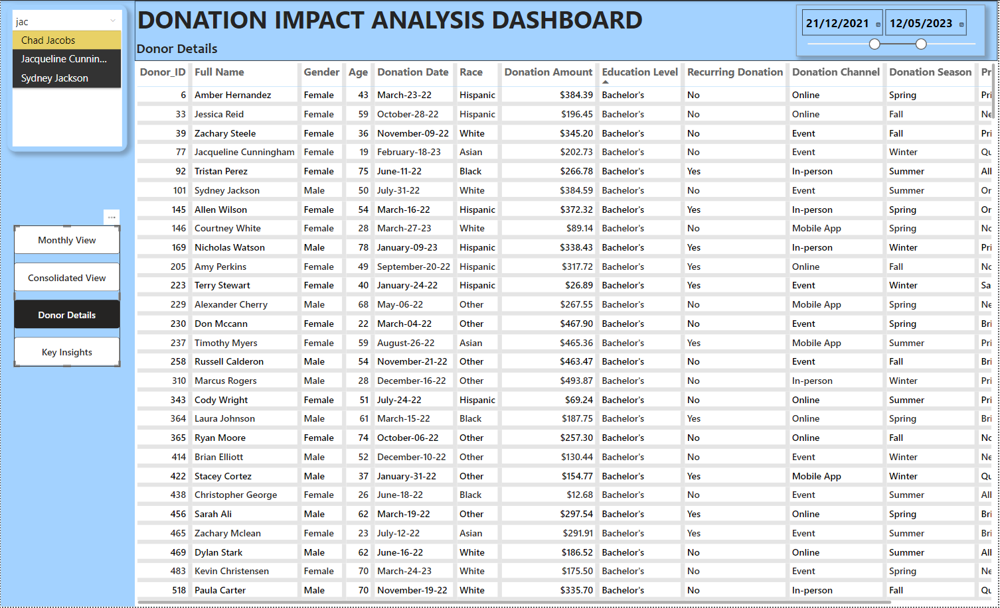
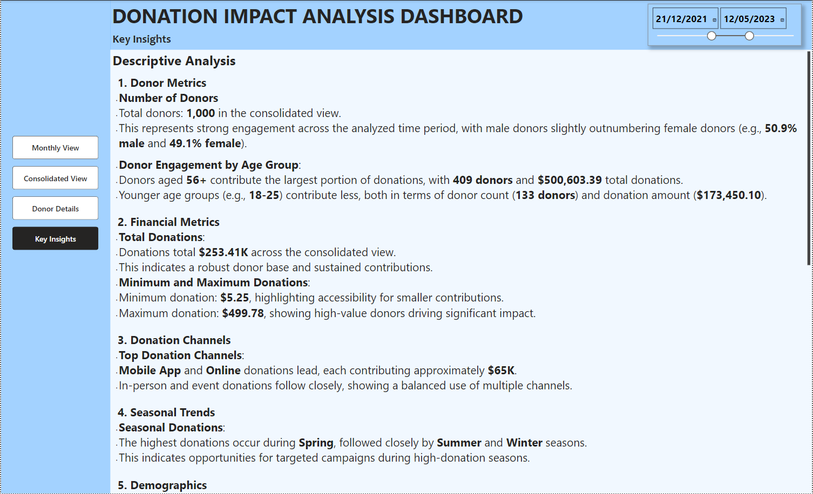

# Charity Donation Analysis Project

## Table of Contents

1. [Overview](#overview)
2. [Project Structure](#project-structure)
   - [Dataset](#1-dataset)
   - [Tools and Technologies Used](#2-tools-and-technologies-used)
3. [Key Features of the Project](#key-features-of-the-project)
   - [Data Cleaning and Preprocessing](#a-data-cleaning-and-preprocessing)
   - [Data Analysis](#b-data-analysis)
     - [SQL Queries for Insights](#sql-queries-for-insights)
     - [Python for Data Exploration](#python-for-data-exploration)
   - [Dashboard in Power BI](#c-dashboard-in-power-bi)
4. [Files in the Repository](#files-in-the-repository)
5. [Key Insights](#key-insights)
6. [How to Use This Repository](#how-to-use-this-repository)
7. [Contributors](#contributors)
8. [License](#license)

---

## Overview

This project provides a comprehensive analysis of charity donation data, focusing on donor demographics, donation trends, and engagement patterns. It aims to optimize non-profit fundraising strategies and uncover actionable insights to enhance donor retention and maximize contributions.

---

## Project Structure

### **1. Dataset**

- **Source**: The charity donation dataset contains detailed information on donor activities, including demographics, donation amounts, and other engagement metrics.
- **Key Features**:
  - `Donor_ID`: Unique identifier for each donor.
  - `Donation_Amount`: Monetary value of each donation.
  - `Donation_Date`: Timestamp of the donation.
  - `Cause_Supported`: The charitable cause for which the donation was made.
  - `Donation_Type`: Indicates whether the donation was recurring or a one-time contribution.
  - `Age`, `Gender`, `Race`: Key demographic details of donors.
  - `Province`, `Communication_Channel`: Geographic and engagement channel details.

### **2. Tools and Technologies Used**

- **SQL**:
  - Data transformation and aggregation.
  - Queries for trend analysis and identification of key patterns.
- **Python**:
  - Advanced preprocessing, handling outliers, and seasonal analysis.
  - Libraries: `pandas`, `numpy`, `matplotlib`.
- **Power BI**:
  - Dynamic dashboards and visual storytelling.
  - Custom visuals for demographic and financial insights.

---

## Key Features of the Project

### **A. Data Cleaning and Preprocessing**

- Utilized SQL and Python to:
  - Remove duplicate records and invalid entries.
  - Handle missing values in key columns.
  - Identify and replace outliers in donation amounts to ensure data consistency.

### **B. Data Analysis**

#### **SQL Queries for Insights**

1. **Monthly Donation Trends**:
   - Aggregate donations by year and month to identify seasonal patterns:
   ```sql
   SELECT YEAR(Donation_Date) AS Year,
          MONTH(Donation_Date) AS Month,
          SUM(Donation_Amount) AS Total_Donations
   FROM data
   GROUP BY YEAR(Donation_Date), MONTH(Donation_Date)
   ORDER BY Year, Month;
   ```
   

2. **Most Popular Causes**:
   - Determine the top causes based on donation amounts:
   ```sql
   SELECT Cause_Supported,
          COUNT(Donor_ID) AS Donor_Count,
          SUM(Donation_Amount) AS Total_Donations
   FROM data
   GROUP BY Cause_Supported
   ORDER BY Total_Donations DESC;
   ```
   

3. **Provincial Donations**:
   - Analyze geographic contributions:
   ```sql
   SELECT Province,
          COUNT(Donor_ID) AS Total_Donors,
          SUM(Donation_Amount) AS Total_Donations
   FROM data
   GROUP BY Province
   ORDER BY Total_Donations DESC;
   ```

#### **Python for Data Exploration**

1. **Data Exploration**:
   - Summary statistics and handling missing values:
   ```python
   print(df.describe())
   print(df.isnull().sum())
   ```
   

2. **Seasonal Donation Patterns**:
   - Group data by seasons to reveal peak donation periods:
   ```python
   seasonal_donations = df.groupby('Donation_Season')['Donation_Amount'].sum()
   print(seasonal_donations)
   ```
   

---

### **C. Dashboard in Power BI**

The interactive Power BI dashboard provides the following insights:

1. **Monthly View**:
   

2. **Consolidated View**:
   

3. **Donor Details**:
   

4. **Key Insights**:
   

---

## Files in the Repository

1. **SQL Scripts**:
   - `Charity_Donation.sql`: Includes all SQL queries used for data analysis and cleaning.
2. **Python Notebook**:
   - `Charity_Donation_Analysis_Project.ipynb`: Preprocessing, exploratory analysis, and advanced insights.
3. **Power BI Dashboard**:
   - `CharityDonationDashboard.pbix`: Comprehensive dashboard with dynamic visuals.
4. **Dataset**:
   - `Cleaned_Master_Dataset.csv`: Final cleaned dataset used for all analyses.

---

## Key Insights

1. **Demographic Trends**:
   - Donors aged **56+** contributed the highest donations, totaling over \$500K, highlighting the importance of engaging older demographics.
   - The **18-25 age group** had the lowest contribution, suggesting potential growth opportunities.
2. **Popular Causes**:
   - **Health** emerged as the top cause, receiving \$269K in donations.
   - Causes like **Education** and **Environment** also showed strong donor engagement.
3. **Seasonal Patterns**:
   - Donations peaked during **Spring**, with consistent contributions in **Winter** and **Summer**.
   - **Fall** had slightly lower activity, offering opportunities for targeted campaigns.
4. **Geographic Distribution**:
   - **Ontario** and **British Columbia** led provincial contributions, emphasizing their strong donor base.
   - Provinces with lower contributions present opportunities for outreach and engagement.
5. **Donation Channels**:
   - Digital platforms like **Mobile App** and **Online** dominated, each contributing \~\$65K.
   - In-person donations remained a significant channel, particularly for events.
6. **Recurring vs. One-Time Donations**:
   - Donations are evenly split, but growing recurring contributions can provide more stability for long-term planning.

---

## How to Use This Repository

1. Clone the repository:
   ```bash
   git clone https://github.com/your-repo/charity-donation-analysis
   ```
2. Open the SQL script file in MySQL Workbench or any SQL editor to replicate the analysis.
3. Open the Jupyter Notebook to explore the dataset and preprocess data.
4. Import the Power BI dashboard file into Power BI Desktop for interactive visualizations

---

## Contributors

- **Ebru Kara**: Led SQL development, Python scripting, and Power BI dashboard creation.

---

## License

This project is licensed under the MIT License. See the `LICENSE` file for more details.

